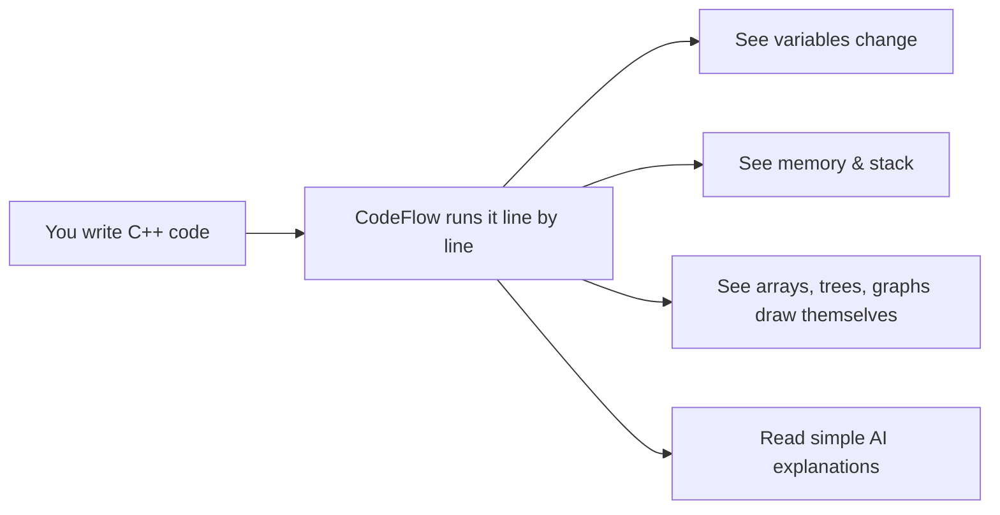
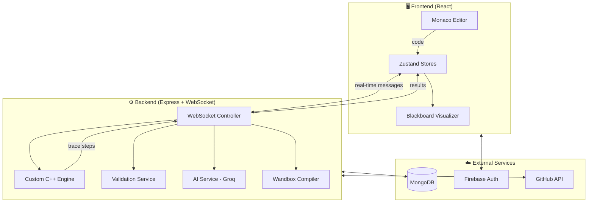
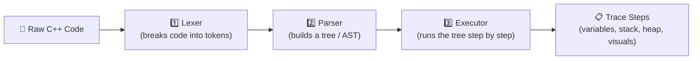
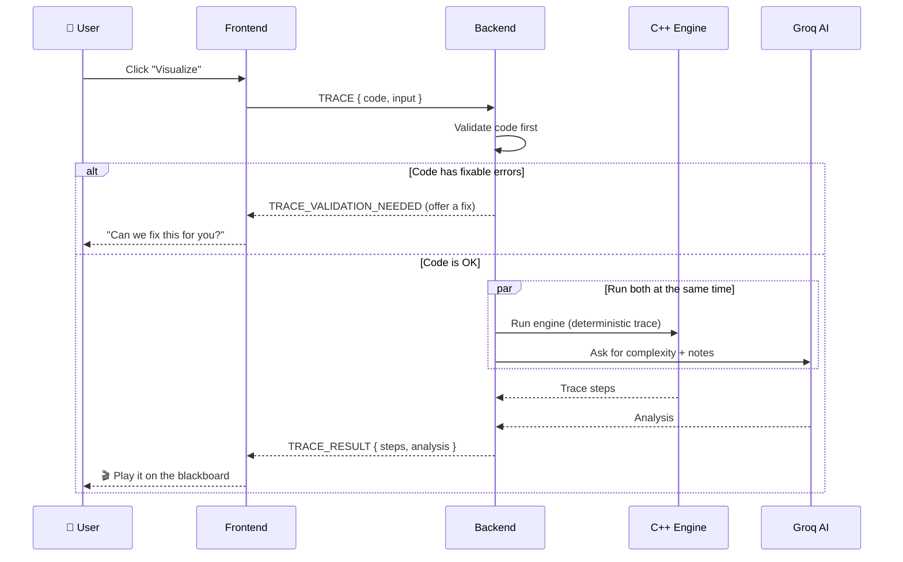
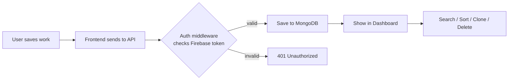
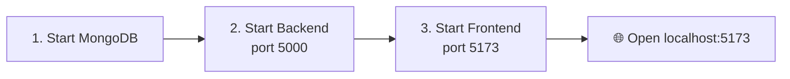
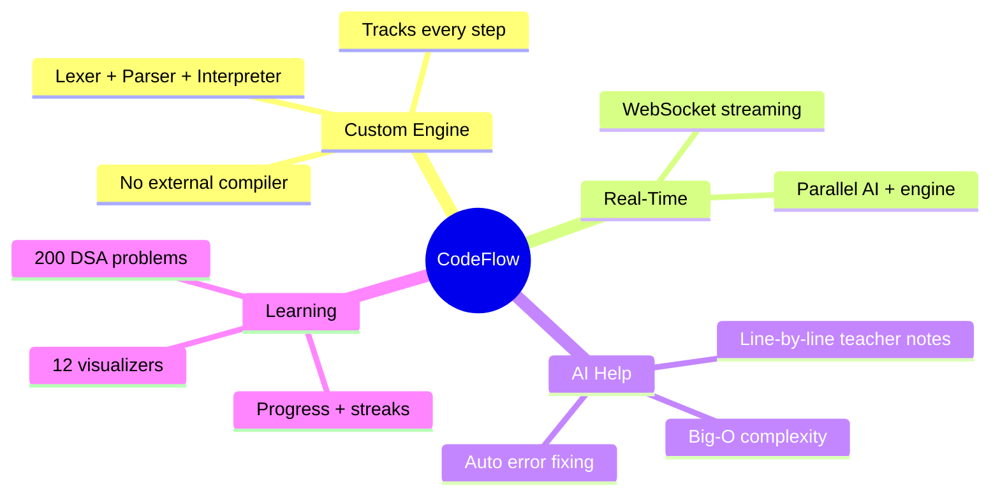

# 🎯 CodeFlow Visualizer

> **See your C++ code come alive.** CodeFlow runs your code step by step and shows you exactly what happens inside — variables, memory, the call stack, arrays, trees, and graphs — all drawn on a live "blackboard" with simple AI explanations.

It works like a teacher standing next to you, pointing at each line and saying *"this is what just happened, and this is why."*

---

## 📚 Table of Contents

1. [What Is This?](#-what-is-this)
2. [Main Features](#-main-features)
3. [Tech Stack](#-tech-stack)
4. [How It Works (Big Picture)](#-how-it-works-big-picture)
5. [The Custom C++ Engine](#-the-custom-c-engine)
6. [Real-Time Flow (WebSockets)](#-real-time-flow-websockets)
7. [Project Structure](#-project-structure)
8. [Data Flow](#-data-flow)
9. [API Routes](#-api-routes)
10. [Setup & Run](#-setup--run)
11. [Environment Variables](#-environment-variables)

---

## 🤔 What Is This?

Most beginners struggle with one big question: **"What is my code actually doing?"**

CodeFlow answers that. You paste some C++ code, press a button, and watch it run **one line at a time**. You can pause, go back, go forward, and slow it down — just like a video player for your code.



---

## ✨ Main Features

| Feature | What It Does |
|--------|--------------|
| 📝 **Monaco Code Editor** | Pro-level C++ editor with colors, autocomplete, and live updates |
| 🎬 **Step-by-Step Playback** | Play, pause, step forward, step back, and change speed |
| 🖼️ **Live Blackboard** | Draws arrays, matrices, stacks, queues, hashmaps, trees, and graphs as they change |
| 🤖 **AI Explanations** | A "teacher note" for each line + Big-O complexity analysis (powered by Groq Llama 3.3) |
| 🩹 **Smart Error Fixing** | Spots mistakes (missing `;`, no `main()`, infinite loops) and offers a fix in plain English |
| 📊 **Flowcharts** | Turns your code's logic into a Mermaid flowchart automatically |
| 💾 **Save Your Work** | Save visualizations, then search, sort, rename, clone, or delete them |
| 🔐 **GitHub Login** | Sign in with GitHub and import code straight from your repos |
| 📈 **Progress & Streaks** | Track solved problems from a 200-problem practice sheet, with daily streaks |

---

## 🛠 Tech Stack

### Frontend (what you see)

| Tool | Why It's Used |
|------|---------------|
| **React 19 + TypeScript** | Build the user interface safely |
| **Vite 7** | Super-fast dev server and builds |
| **TailwindCSS 4** | Quick, clean styling |
| **Zustand 5** | Manage app state (auth, execution, saved work) |
| **Framer Motion 12** | Smooth animations on the blackboard |
| **Monaco Editor** | The code editor (same engine as VS Code) |
| **Mermaid 11** | Draw flowcharts |
| **Three.js** | Visual background effects |
| **Firebase Auth** | Login with GitHub |

### Backend (the brain)

| Tool | Why It's Used |
|------|---------------|
| **Node.js + Express 5** | The web server |
| **WebSocket (ws)** | Real-time, two-way messages |
| **Custom C++ Engine** | Hand-written lexer + parser + interpreter (no external compiler needed) |
| **MongoDB + Mongoose** | Save users, visualizations, blogs, and more |
| **Groq SDK (Llama 3.3 70B)** | AI explanations and complexity analysis |
| **Firebase Admin SDK** | Verify login tokens |
| **Wandbox API** | Run real code for true output |
| **Helmet + Compression** | Security and speed |

---

## 🗺 How It Works (Big Picture)

Here is the whole system in one diagram:



**In simple words:**
1. You type code in the editor.
2. The frontend sends it to the backend over a live connection.
3. The backend checks it, runs it with the custom engine, and asks the AI for help.
4. The backend sends back a list of "steps."
5. The frontend plays those steps on the blackboard.

---

## 🧠 The Custom C++ Engine

This is the most special part of the project. Instead of using a normal compiler, CodeFlow has its **own C++ interpreter built from scratch** in TypeScript. This lets it watch every single step and record what happens.

It has three parts:



| Part | Size | Job |
|------|------|-----|
| **Lexer** | ~1,400 lines (with parser) | Turns text like `int x = 5;` into small pieces called *tokens* |
| **Parser** | (same file) | Connects tokens into a tree that shows structure |
| **Executor** | ~4,400 lines | Walks the tree and records every change |

**What the engine understands:**

| Supported | Examples |
|-----------|----------|
| Variables & types | `int`, `string`, `bool`, `double`, `auto`, etc. |
| Loops & conditions | `for`, `while`, `if / else` |
| Functions | calls, returns, the call stack |
| Classes & structs | `class`, `this`, member access |
| Pointers & memory | `new`, `delete`, a real heap model |
| STL containers | `vector`, `map`, stacks, queues |

Every time a line runs, the engine saves a **snapshot**: which line, what the variables are, what's on the stack, what's in memory, and what to draw. (It stops at 2,000 steps to stay fast.)

---

## ⚡ Real-Time Flow (WebSockets)

The frontend and backend talk using a live WebSocket connection. They send small typed messages back and forth.



**Message types the backend understands:**

| Message | Meaning |
|---------|---------|
| `EXECUTE` | Simulate / visualize the code |
| `RUN_CODE` | Run real code (via Wandbox) for true output |
| `VALIDATE` | Only check the code for errors |
| `TRACE` | Build the step-by-step blackboard trace |
| `EXECUTE_WITH_FIX` | Run the code after the user accepts a fix |

> 💡 **Smart move:** the engine and the AI run **in parallel** (`Promise.all`), so the user waits less.

---

## 📁 Project Structure

```
codeflow/
├── backend/
│   └── src/
│       ├── config/        # MongoDB + Firebase setup
│       ├── controllers/   # Handle requests (execution, github, blog...)
│       ├── engine/        # ⭐ Custom C++ lexer, parser, executor
│       ├── middleware/    # Firebase auth check
│       ├── models/        # MongoDB schemas (User, Visualization...)
│       ├── routes/        # REST API endpoints
│       ├── services/      # AI, compiler, validation, tracing
│       ├── websocket/     # Live connection setup
│       └── server.ts      # App entry point
│
└── frontend/
    └── src/
        ├── components/    # Navbar, dialogs, shared widgets
        ├── config/        # API + Firebase config
        ├── data/          # 200-problem practice sheet
        ├── features/      # Auth, workspace, visualizer panels
        ├── pages/         # Home, Dashboard, Workspace, etc.
        ├── store/         # Zustand state stores
        └── App.tsx        # Routes
```

---

## 🔄 Data Flow

How a saved visualization travels through the system:



**The data we store:**

| Model | What It Holds |
|-------|---------------|
| **User** | Profile, GitHub token, progress map, streak, activity log |
| **Visualization** | Saved code, inputs, speed, problem info |
| **Blog / Doc** | Articles and documentation |
| **Feedback** | User feedback messages |
| **Notification** | User notifications |

---

## 🔌 API Routes

The backend groups its REST endpoints by topic:

| Base Route | Purpose |
|-----------|---------|
| `/api/problems` | The DSA practice problems |
| `/api/users` | User accounts & progress |
| `/api/visualizations` | Saved blackboard states |
| `/api/dashboard` | Dashboard data |
| `/api/profile` | Profile settings |
| `/api/github` | GitHub OAuth + import files |
| `/api/feedback` | Send feedback |
| `/api/blogs` | Blog posts |
| `/api/docs` | Documentation |
| `/api/notifications` | Notifications |
| `/api/contact` | Contact form |
| `/health` | Server health check |

---

## 🚀 Setup & Run

You need **three things running**: MongoDB, the backend, and the frontend.



### Step 1 — Database
```bash
mongod
```

### Step 2 — Backend
```bash
cd backend
npm install
npm run dev
# ✅ Server runs on http://localhost:5000
```

### Step 3 — Frontend
```bash
cd frontend
npm install
npm run dev
# ✅ App runs on http://localhost:5173
```

Then open **http://localhost:5173** and start visualizing! 🎉

> Log in to sync your **Curated Sheet** progress and to use the **Dashboard** for saving, loading, and managing your work.

---

## 🔐 Environment Variables

### Backend (`backend/.env`)

| Variable | Example | Needed For |
|----------|---------|-----------|
| `PORT` | `5000` | Server port |
| `MONGODB_URI` | `mongodb://localhost:27017/codeflow` | Database |
| `GROQ_API_KEY` | `gsk_...` | AI explanations |
| `FIREBASE_PROJECT_ID` | `codeflow-91a31` | Auth check |
| `GITHUB_CLIENT_ID` | `...` | GitHub login (optional) |
| `GITHUB_CLIENT_SECRET` | `...` | GitHub login (optional) |

### Frontend (`frontend/.env`)

| Variable | Needed For |
|----------|-----------|
| `VITE_API_URL` | Where the backend lives (e.g. `http://localhost:5000`) |
| `VITE_FIREBASE_API_KEY` | Firebase login |
| `VITE_FIREBASE_AUTH_DOMAIN` | Firebase login |
| `VITE_FIREBASE_PROJECT_ID` | Firebase login |
| `VITE_FIREBASE_APP_ID` | Firebase login |

---

## 🌟 Why This Project Is Cool



Built with ❤️ to make learning to code feel less like magic and more like watching a story unfold.
